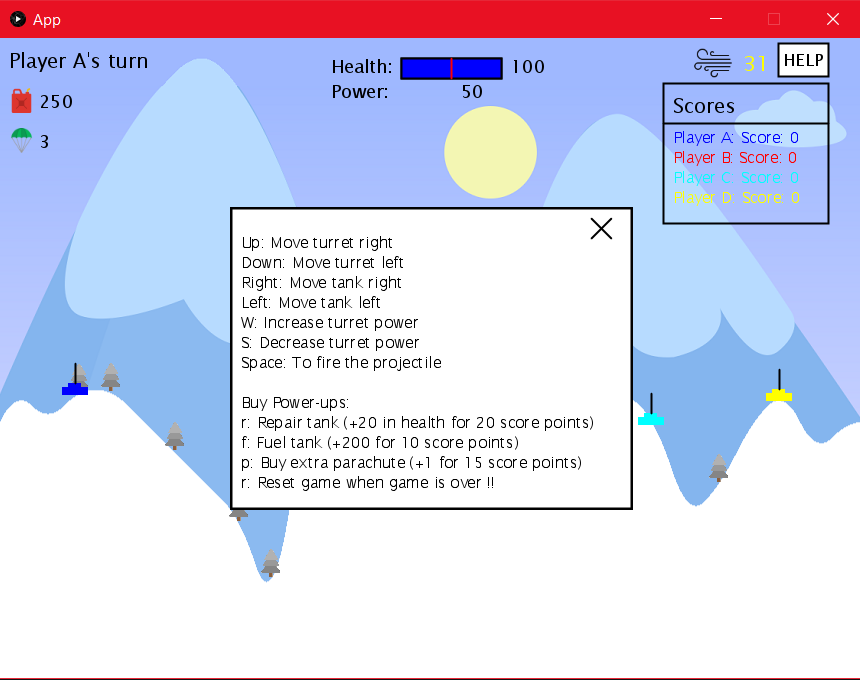
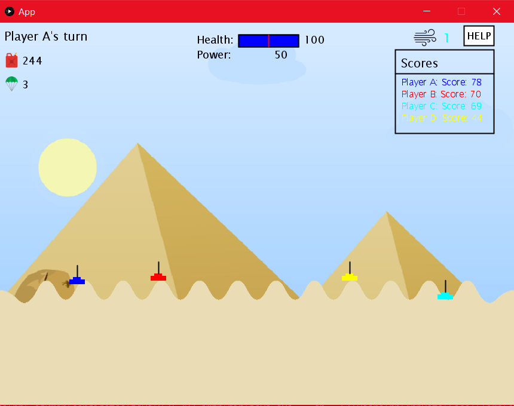
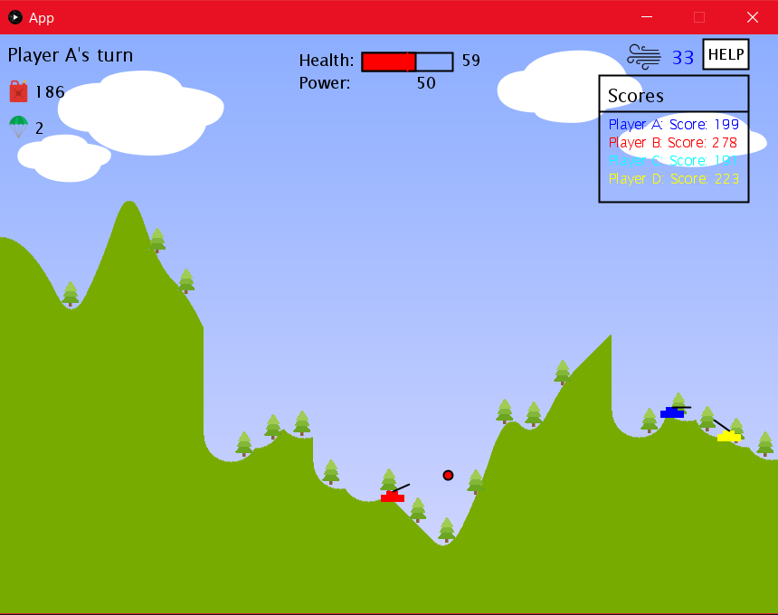
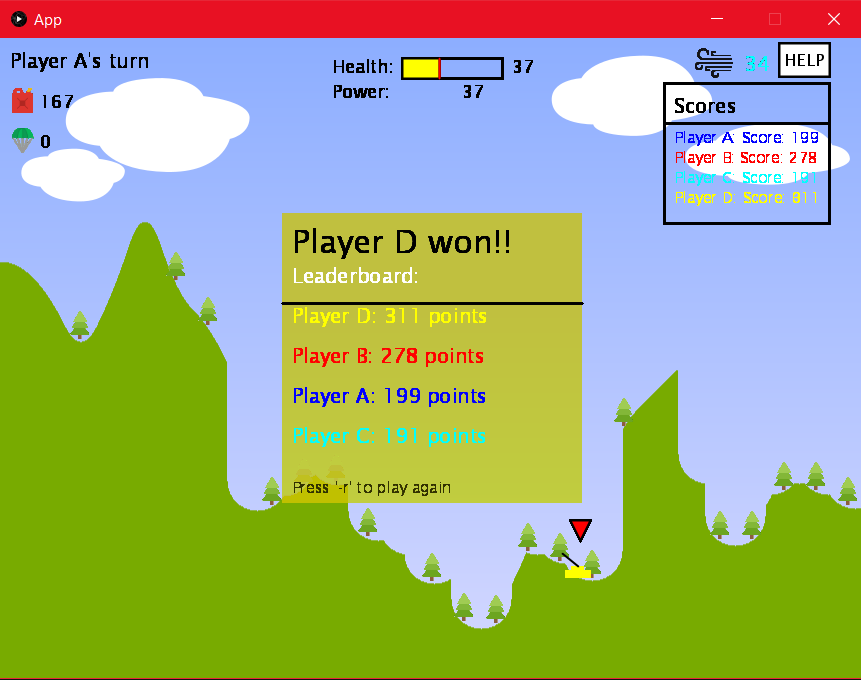

# Tank Game: Take Aim and Blast Your Way to Victory!

This is a thrilling Java game where you command a tank and battle against opponents in a series of challenging levels. Sharpen your skills, strategize your attacks, and dominate the battlefield as you eliminate enemies and conquer a series of challenging levels.

## Sharpen Your Skills and Conquer the Battlefield:

- **Explosive Gameplay:** Master the art of aiming and firing your tank's cannon to take down your rivals.
- **Strategic Powerups:** Earn and utilize powerups like repair kits and extra fuel to gain a tactical advantage.
- **Level Up the Challenge:** Progress through diverse levels, each meticulously crafted to test your combat prowess.
- **Dominate the Scoreboard:** Rack up points by strategically eliminating enemies and climb the ranks to become the ultimate tank commander.
- **Smooth Performance:** Enjoy a visually stunning and responsive game experience.

## Key Features:

- Engaging tank-to-tank combat mechanics.
- Intuitive controls for maneuvering and aiming your tank.
- Multiple levels with distinct challenges.
- Powerup system for enhancing your tank's capabilities.
- Compelling visual effects and animations.

## Ready to Roll Out?

### Requirements:

- **Java 8:** Ensure you have Java 8 installed on your system. You can download it from the [Java download page](https://www.oracle.com/java/technologies/javase-jdk8-downloads.html).
- **Gradle:** Make sure you have Gradle installed. Instructions for installation can be found on the [Gradle website](https://gradle.org/install/).

### Installation:

1. **Clone the Repository:** (Provide instructions specific to your hosting platform, like GitHub)
2. **Navigate to the Project Directory:** Open a terminal or command prompt and navigate to the directory where you cloned the repository.
3. **Running the Game:** Execute the following command in your terminal:
    ```bash
    gradle run
    ```

Dive into the world of tank warfare and experience the thrill of strategic combat!

### Additional Notes:
- This game is built using the Processing library for graphics and animations.
- The target frame rate is 30 FPS for a smooth gameplay experience.

## Future Enhancements:

- **AI Opponents:** Integrate AI-controlled opponents to provide a more dynamic and challenging gameplay experience.
- **Unlimited Levels:** Implement procedural level generation for endless replayability, ensuring you always face new battlegrounds.
- **Global Leaderboards (future implementation):** Compete against players worldwide and showcase your tank mastery by climbing the global leaderboards.
- **Sound Effects and Music:** Immerse yourself in the heat of battle with thrilling sound effects and a pulse-pounding soundtrack (future implementation).
- **Additional Powerups:** Introduce new powerups that offer unique strategic possibilities, further expanding your tactical options.

> **Note:**
> 
> This game is built using the Processing library for graphics and animations. Please refer to the [Processing documentation](https://processing.org/reference/) for more details.

## Screenshots:

### Main Menu


### How To Play


### In-Game Action
 
 


### Level Complete

